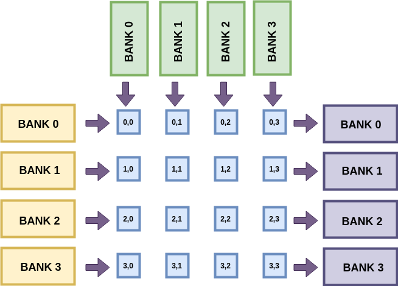

# LAB4 : Matrix Multiplication (MM) module : Deployment on the _PYNQ_ board 

## Objective

In the previous lab, you designed and simulated a systolic matrix multiplication kernel. For simplicity, we read out the final result in parallel with appropriate valids.
In this lab, you will (1) modify the readout mechanism to support a systolic (serial) operation, and (2) deploy the circuit on a real FPGA board.
We will provide the required hardware infrastructure to generate input matrices on the ARM CPU of the FPGA boad, send it to your systolic core, and read the result back to the ARM CPU for validation.
We will use the _PYNQ_ FPGA board for this lab, which is a user-friendly FPGA+ARM SoC (System-on-Chip) that allows you to run an embedded Linux stack on the ARM CPU and use the FPGA as an accelerator. Pynq board also ships with user-friendly Python APIs which we will use for programming and interacting with the FPGA.

Specific tasks are below:

* [**Submission 4a** Due on March 29th] Modify your systolic array to readout the `m2` result matrix serially per row. This will need a change to the interface of `pe.v`, some extra internal registers for holding state, and more wires in `systolic.sv` to shift out the data. Test your design for functional correctness by using similar test setup as the previous lab. 

* [**Submission 4b** Due on April 5th] Synthesise, implement, and download your design bitstream to the _PYNQ_ board. Setup the Pynq board for use with your lab, and run the Python-based test framework to confirm correct operation.


## Design Description:

### Memory Banking :

We supply the input matrices `m0` and `m1` in row-serial and column-serial fashion just like Lab3. We now move some portions of the testbench into hardware for use with the FPGA board.

For FPGA implementation, each input matrix is stored across multi-ported memory banks. From Lecture 7 on Memory, recall that we can create banked memories using block partitioning. Each memory bank will feed data into a corresponding lane of the systolic array. We will create N banks (row-wise) for `m0` to the left of the systolic array, and N banks (column-wise) for `m1` at the top of the systolic array. 
We will collect the result `m2` of the matrix multiplication from the right side of the array.

This is shown in the figure below:



Hence, PE[0][0], PE[0][1], PE[0][2] and PE[0][3] will read `m0` from Bank0 on the left and write the result `m2` elements to Bank 0 on the right. All columns of `m1` will feed this row in parallel from all the banks at the top. 

The banked memory structure has been provided to you as part of the lab infrastructure. You only need to implement the ability to shift out `m2` serially per lane of the systolic array into the banks. To do this, you have to make the following changes to your code:

### Rewiring `pe.v` and `systolic.sv`:

You must add a new pair of ports to the PE to stream out `m2` serially. Thus, each PE will need an input `in_data` + `in_valid` from the left and an output `out_data` + `out_valid` shifting data out. 
Remember that the PE cannot be stopped in the middle of the computation. Particularly when M>N, this serial readout must happen, *in parallel* with actual multiply-accumulate operation. 
Think carefully of the minor internal changes needed to the PE.

This must be reflected in `systolic.sv` when you instantiate the PEs and connect them to each other.

The file `counter.v` is unmodified from the previous lab. 

### Testbench Design :

The testbench will simulate banked memories and be primarily responsible for sending `m0` and `m1` test matrix data into the array, gathering the result from `m2` 
and helping you verify correctness of operation. We use `$readmemh` function to read binary matrix data into memories implemented in the test bench. The testbench
creates individual data streams for each memory bank to load data serially into the systolic array. In the end, the `m2` memory data is used to assist correctness 
checks. Unlike the testbench in Lab3, our current testbench abstracts the input and output ports to use AXI-Streams for integration with ARM CPU on the _Pynq_ board.

The testbench also generates enable signals for your counters based on values of M and N. T The testbench uses the data and valid hooks from you design to write serially into banked memories of `m2`. 


We also provide a Python testing setup to help you generate new matrices. You can run `make test M=8, N=8` to better visualize input and output together, and confirm if it matches expected result.
```
Matrix 0 (m0) is
[[3. 1. 8. 1. 3. 5. 6. 0.]
 [3. 5. 8. 9. 0. 0. 5. 7.]
 [4. 4. 4. 1. 4. 0. 9. 8.]
 [1. 6. 0. 1. 8. 7. 3. 6.]
 [0. 1. 1. 3. 9. 2. 4. 0.]
 [8. 1. 0. 6. 8. 2. 2. 0.]
 [4. 2. 0. 3. 9. 3. 3. 6.]
 [8. 1. 7. 3. 1. 1. 9. 2.]]
Matrix 1 (m1) is
[[7. 9. 6. 0. 4. 6. 3. 5.]
 [2. 5. 1. 8. 1. 6. 0. 4.]
 [5. 5. 0. 2. 3. 6. 3. 5.]
 [4. 7. 2. 4. 3. 9. 7. 5.]
 [0. 1. 7. 9. 8. 0. 5. 0.]
 [9. 8. 6. 0. 3. 0. 1. 7.]
 [6. 7. 1. 2. 8. 8. 0. 3.]
 [7. 8. 7. 1. 6. 7. 8. 7.]]
Answer is
[[148. 164.  78.  67. 127. 129.  60. 117.]
 [186. 246.  95. 109. 150. 266. 152. 184.]
 [170. 214. 123. 106. 187. 209. 115. 144.]
 [146. 179. 157. 136. 158. 117. 105. 134.]
 [ 61.  84.  86. 111. 123.  71.  71.  50.]
 [112. 157. 131. 108. 137. 124. 108.  94.]
 [131. 169. 158. 121. 168. 129. 129. 115.]
 [182. 221.  91.  63. 158. 209.  88. 142.]]
Your answer is:
[[148. 164.  78.  67. 127. 129.  60. 117.]
 [186. 246.  95. 109. 150. 266. 152. 184.]
 [170. 214. 123. 106. 187. 209. 115. 144.]
 [146. 179. 157. 136. 158. 117. 105. 134.]
 [ 61.  84.  86. 111. 123.  71.  71.  50.]
 [112. 157. 131. 108. 137. 124. 108.  94.]
 [131. 169. 158. 121. 168. 129. 129. 115.]
 [182. 221.  91.  63. 158. 209.  88. 142.]]
##########
Thank Mr. Goose
##########
```

## Creating your design : 

You must provide RTL implementations of the following designs with associated interfaces.

#### `pe.v`

1. `clk` : 1 bit input : This is the clock input to the module
2. `rst` : 1 bit input : This is a synchronous reset signal
3. `init` : 1 bit input : This is the init signal that flushes the accumulator
4. `in_a` : D_W bits input : This is the first PE operand.
5. `in_b` : D_W bits input : This is the second PE operand.
6. `out_a` : D_W bits output : This is the output that streams out registered in_a
7. `out_b` : D_W bits output : This is the output that streams out registered in_b
8. `in_data` : 2*D_W bits input : This is the input stream of `m2` matrix data [**new**]
9. `in_valid` : 1 bit input : Valid signal for `in_data` [**new**]
10. `out_data` : 2*D_W output : This is the output stream of `m2` matrix data [**new**]
11. `out_valid` : i bit output : Valid signal for `out_data` [**new**]


#### `systolic.sv` 

1. `clk` : 1 bit input : This is the clock input to the module
2. `rst` : 1 bit input : This is a synchronous reset signal
3. `enable_row_count_m0` : 1 bit input : Enable counter operation for the cascaded counter (row counter of `m0`).
4. `m0` : D_W bits x N bits input : `m0`'s data lane to feed into systolic array
5. `m1` : D_W bits x N bits input : `m1`'s data lane to feed into systolic array
6. `column_m0` : $clog2(M) bits output : Column pointer generated by counter associated with `m0` matrix
7. `row_m0` : $clog2(M/N) bits output : Row pointer generated by counter associated with `m0` matrix
8. `column_m1` : $clog2(M/N) bits output : Column pointer generated by counter associated with `m1` matrix
9. `row_m1` : $clog2(M) bits output : Column pointer generated by counter associated with `m1` matrix
10. `m2` : 2*DW bits x N bits output: Data us for `m2`. Each channel connected to a separate systolic lane.
11. `valid_m2` : N bits output : Valid bus for `m2`. Each channel connected to a separate systolic lane. [**new**]

## Testing your design : 

As with all labs, you have to use `jane.uwaterloo.ca` or `deathstar.eng.uwaterloo.ca` for your lab work.

### Simulation
To compile and simulate test your module, simply type `make modelsim M=4 N=4`. Modelsim will start in GUI mode.  

If you prefer iverilog and gtkwave (OSS tools), you can use `make iverilog M=4 N=4` instead.

To avoid using GUIs, you can use `make iverilog-txt M=4 N=4` or `make modelsim-txt` Make rules.

[**Submission 4a**] To functionally test your design end-to-end from matrix multiplication operation using our Python test wrappers, use `make test M=<val> N=<val>`. This will first launch the iverilog tool to generate the output memory snapshot of the resultant matrix. Consequently, a python script comparing your
output memory with the correct result will let you know if your implementation is functionally correct.

### Synthesis and Board Deployment
To map the design to the board, we have provided a set of wrappers and Tcl scripts for Vivado compilation. Please invoke `make vivado M=4 N=4` to generate the bitstream.
 
Once the bitstream is generated, you can test this on the board with `make board M=4 N=4` command. 

Remember to recompile the design for a few M, N combinations.

[**Submission 4b**] To run the design on your board, you will need to (1) generate FPGA bitstream, (2) copy bitstrem to _Pynq_ board, (3) run python test code on the ARM CPU of the _Pynq_ board. 
Please submit two bitstreams for M=4, N=4 case and M=8, N=4 case

### Competition Scoring

40% of the lab grade will be reserved for functional correctness in simulation for M=4 N=4, and M=8, N=4 cases.
40% of the lab grade will be reserved for functional correctness in hardware for M=4 N=4, and M=8, N=4 cases.
20% of the final grade will be reserved for relative ranking between teams. 

These relative ranking component is worth 10 points.

We will use following formula to rank teams `score = clock_frequency * N`
Teams will get points based on this equation `points = 5+5*(your_score-133*4)/(max_score-133*4)`
Team with the `score` value i.e. `max_score` will get full 10 points. 
Teams that get 133 MHz operation and can fit N=4 will achieve a score of `133*4` and will get a default 5 points.
